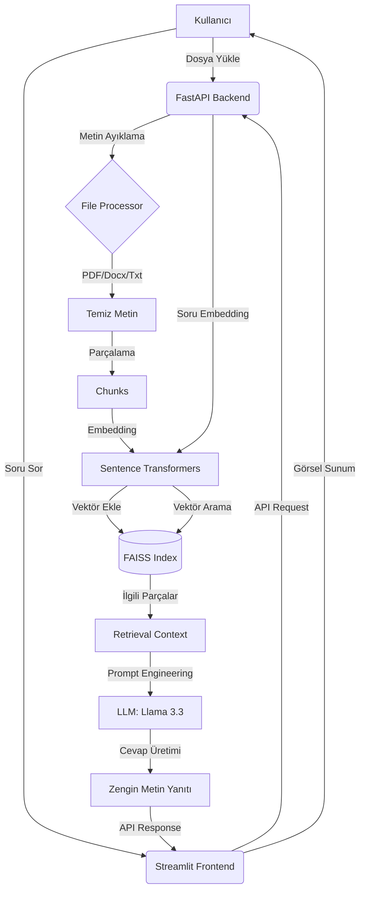

# DocuMind: RAG Tabanlı Doküman Soru-Cevap Sistemi

DocuMind, kullanıcıların PDF, DOCX ve TXT dosyalarını yükleyerek bu dosyalar hakkında akıllı sorular sormasına olanak tanıyan, Retrieval-Augmented Generation (RAG) teknolojisini kullanan modern bir web uygulamasıdır.

## Özellikler

- **Çoklu Dosya Desteği:** PDF, DOCX ve TXT formatındaki belgeleri kolayca yükleyin.
- **Akıllı Arama (RAG):** Sorularınız, belgenin en ilgili bölümleri bulunarak LLM (Llama 3.3) tarafından yanıtlanır.
- **Esnek Filtreleme:** İsterseniz tüm belgelerde, isterseniz sadece seçtiğiniz belirli belgelerde arama yapın.
- **Otomatik Özetleme:** Uzun dokümanları tek tıkla özetleyin.
- **Soru Önerileri:** Doküman içeriğine göre yapay zeka tarafından üretilen soru önerileri ile keşfe başlayın.
- **Modern Arayüz:** Streamlit ile geliştirilmiş, kullanıcı dostu ve estetik tasarım.

## Teknoloji Yığını

- **Backend:** FastAPI (Python)
- **Frontend:** Streamlit
- **Vektör Veritabanı:** FAISS (CPU)
- **Embedding Modeli:** `paraphrase-multilingual-MiniLM-L12-v2` (SentenceTransformers)
- **LLM:** Groq (Llama-3.3-70b-versatile)

## Proje Yapısı

```text
rag-document-qa/
├── backend/            # FastAPI servisleri ve RAG motoru
├── frontend/           # Streamlit arayüzü ve bileşenleri
├── uploads/            # Yüklenen belgelerin saklandığı dizin
├── archive/            # Eski veya yedeklenen dosyalar
├── requirements.txt    # Gerekli kütüphaneler
├── .env.example        # Örnek çevre değişkenleri
└── README.md           # Proje dokümantasyonu
```

## Kurulum ve Çalıştırma

### 1. Gereksinimler
Sisteminizde Python 3.9+ yüklü olmalıdır.

### 2. Kurulum
Öncelikle bağımlılıkları yükleyin:
```bash
pip install -r requirements.txt
```

### 3. Yapılandırma
Kök dizinde bir `.env` dosyası oluşturun ve Groq API anahtarınızı ekleyin:
```env
GROQ_API_KEY=your_groq_api_key_here
```

### 4. Başlatma
Projenin çalışması için hem backend hem de frontend'i başlatmanız gerekir.

**Backend'i Başlatın:**
```bash
uvicorn backend.main:app --reload
```

**Frontend'i Başlatın (Yeni bir terminalde):**
```bash
streamlit run frontend/app.py
```

## Sistem Mimarisi



1. **Doküman İşleme:** Dosya yüklenir, metinler ayıklanır ve küçük parçalara (chunks) bölünür.
2. **Vektörizasyon:** Metin parçaları embedding modelleri ile vektörlere dönüştürülür ve FAISS indeksine eklenir.
3. **Retrieval (Getirme):** Kullanıcı bir soru sorduğunda, soru vektörü ile indeksteki parçalar karşılaştırılır ve en yakın parçalar getirilir.
4. **Generation (Üretim):** Seçilen parçalar ve kullanıcı sorusu bir "System Prompt" ile birleştirilerek LLM'e (Groq) gönderilir.
5. **Cevap:** LLM, sadece verilen bağlamı kullanarak doğru ve güvenilir bir cevap üretir.

---
*Bu proje YZT Akademi kapsamında geliştirilmiştir.*
